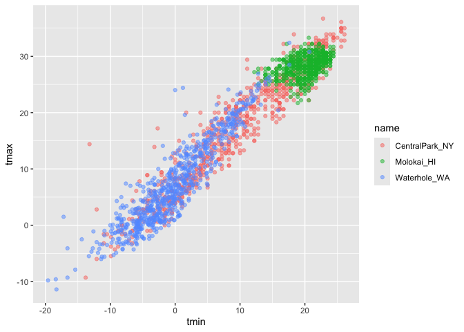
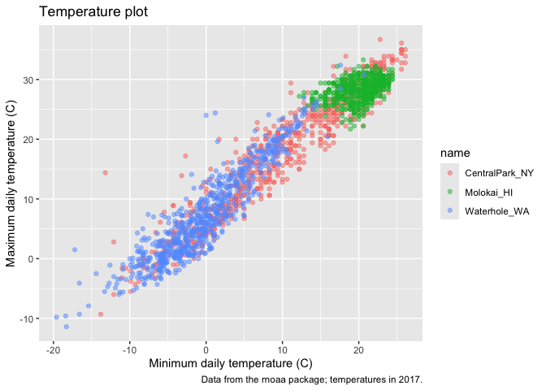
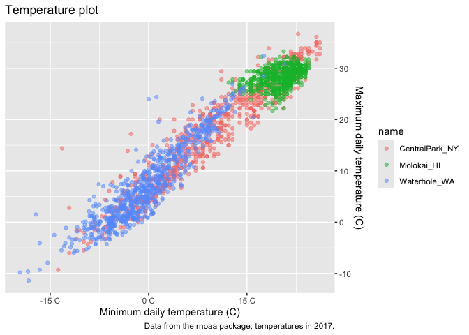
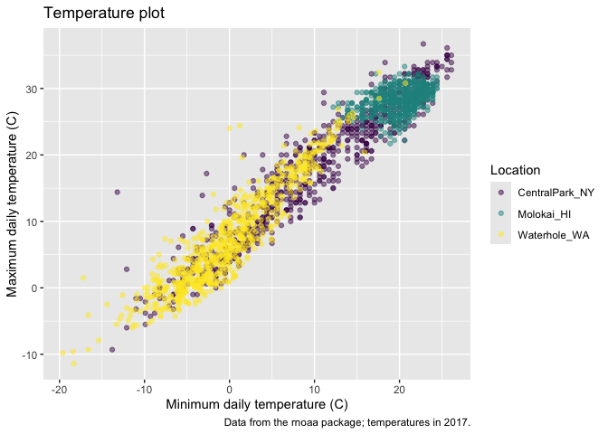
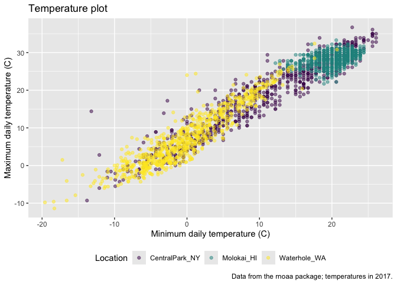
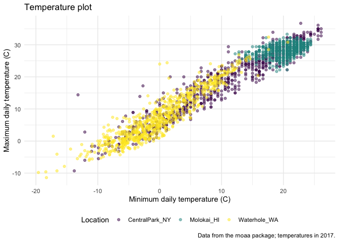
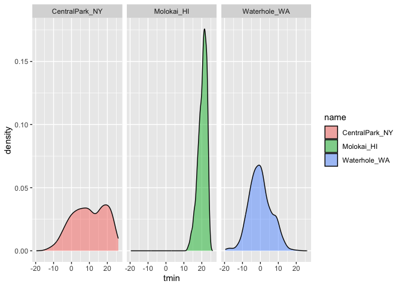
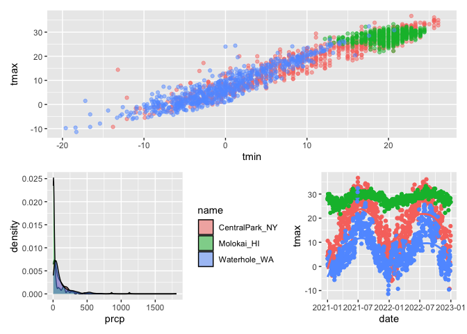

Visualization
================

``` r
library(tidyverse)
```

    ## ── Attaching core tidyverse packages ──────────────────────── tidyverse 2.0.0 ──
    ## ✔ dplyr     1.1.4     ✔ readr     2.1.5
    ## ✔ forcats   1.0.0     ✔ stringr   1.5.1
    ## ✔ ggplot2   3.5.2     ✔ tibble    3.3.0
    ## ✔ lubridate 1.9.4     ✔ tidyr     1.3.1
    ## ✔ purrr     1.1.0     
    ## ── Conflicts ────────────────────────────────────────── tidyverse_conflicts() ──
    ## ✖ dplyr::filter() masks stats::filter()
    ## ✖ dplyr::lag()    masks stats::lag()
    ## ℹ Use the conflicted package (<http://conflicted.r-lib.org/>) to force all conflicts to become errors

``` r
library(patchwork)
```

## Load the weather data

``` r
library(p8105.datasets)
data("weather_df")
```

## Remember this plot..?

``` r
weather_df %>% 
  ggplot(aes(x = tmin, y = tmax, color = name)) +
  geom_point(alpha = .5)
```

    ## Warning: Removed 17 rows containing missing values or values outside the scale range
    ## (`geom_point()`).

<!-- -->

``` r
weather_df %>% 
  ggplot(aes(x = tmin, y = tmax, color = name)) +
  geom_point(alpha = .5)+
labs(
  title = "Temperature plot",
  x = "Minimum daily temperature (C)",
  y = "Maximum daily temperature (C)",
  caption = "Data from the rnoaa package; temperatures in 2017."
)
```

    ## Warning: Removed 17 rows containing missing values or values outside the scale range
    ## (`geom_point()`).

<!-- -->

## Scales

Start with the same plot

``` r
weather_df %>% 
  ggplot(aes(x = tmin, y = tmax, color = name)) +
  geom_point(alpha = .5)+
labs(
  title = "Temperature plot",
  x = "Minimum daily temperature (C)",
  y = "Maximum daily temperature (C)",
  caption = "Data from the rnoaa package; temperatures in 2017."
) +
scale_x_continuous(
  breaks = c(-15, 0 , 15),
  labels = c("-15 C", "0 C", "15 C")
)+
scale_y_continuous(
  position= "right"
)
```

    ## Warning: Removed 17 rows containing missing values or values outside the scale range
    ## (`geom_point()`).

<!-- -->

Look at color scales

``` r
weather_df %>% 
  ggplot(aes(x = tmin, y = tmax, color = name)) +
  geom_point(alpha = .5)+
labs(
  title = "Temperature plot",
  x = "Minimum daily temperature (C)",
  y = "Maximum daily temperature (C)",
  caption = "Data from the rnoaa package; temperatures in 2017."
) +
   viridis::scale_color_viridis(
     name = "Location",
     discrete = TRUE)
```

    ## Warning: Removed 17 rows containing missing values or values outside the scale range
    ## (`geom_point()`).

<!-- -->

**scale_color_hue( name = “Location”, h = c(100,300))** to change color
and name of legend

## Themes- doesn’t depend on data

Shift the Legend.

``` r
weather_df %>% 
  ggplot(aes(x = tmin, y = tmax, color = name)) +
  geom_point(alpha = .5)+
labs(
  title = "Temperature plot",
  x = "Minimum daily temperature (C)",
  y = "Maximum daily temperature (C)",
  caption = "Data from the rnoaa package; temperatures in 2017."
) +
   viridis::scale_color_viridis(
     name = "Location",
     discrete = TRUE) +
  theme(legend.position = "bottom")
```

    ## Warning: Removed 17 rows containing missing values or values outside the scale range
    ## (`geom_point()`).

<!-- -->

Change the overall theme.

``` r
weather_df %>% 
  ggplot(aes(x = tmin, y = tmax, color = name)) +
  geom_point(alpha = .5)+
labs(
  title = "Temperature plot",
  x = "Minimum daily temperature (C)",
  y = "Maximum daily temperature (C)",
  caption = "Data from the rnoaa package; temperatures in 2017."
) +
   viridis::scale_color_viridis(
     name = "Location",
     discrete = TRUE) +
   theme_minimal() +
  theme(legend.position = "bottom")
```

    ## Warning: Removed 17 rows containing missing values or values outside the scale range
    ## (`geom_point()`).

<!-- -->

\##Setting options copy and paste in r markdown document in beginning to
set the visual

``` r
library(tidyverse)

knittr::opts_chunk$set(
    fig.width = .6,
    fig. asp = .6,
    out.width = "90%"
)

theme_set(theme_minimal() + theme(legend.postion = "bottom"))

options(
  ggplot2.continuous.colour = "viridis"
  ggplot2.continuous.fill = "viridis"
)

scale_colour_discrete = scale_color_viridis_d
scale_fill_discrete = scale_fill_viridis_d
```

## Data args in `geom`

``` r
central_park = 
  weather_df %>% 
  filter(name == "CentralPark_NY")

molokai =
  weather_df %>% 
  filter(name == "Molokai_HI")
  
ggplot(data = molokai, aes(x = date, y = tmax, color = name)) +
  geom_point() +
  geom_line(data = central_park)
```

    ## Warning: Removed 1 row containing missing values or values outside the scale range
    ## (`geom_point()`).

<!-- -->

## `patchwork`

remember faceting?

``` r
weather_df %>% 
  ggplot(aes(x =tmin, fill = name)) +
  geom_density(alpha = .5) +
  facet_grid(. ~name)
```

    ## Warning: Removed 17 rows containing non-finite outside the scale range
    ## (`stat_density()`).

<!-- -->

what happens when you want multiplanel plots but can’t facet?: patchwork

``` r
tmax_tmin_p =
weather_df %>% 
  ggplot(aes(x =tmin, y = tmax, color = name)) +
  geom_point(alpha= .5) +
  theme(legend.position = "none")

prcp_dens_p =
  weather_df %>% 
  filter(prcp > 0) %>% 
  ggplot(aes(x =prcp, fill = name)) +
  geom_density(alpha = .5)

tmax_data_p =
  weather_df %>% 
  ggplot(aes(x = date, y = tmax, color = name)) +
  geom_point() +
  geom_smooth(se = FALSE) +
  theme(legend.position = "none")

tmax_tmin_p / (prcp_dens_p + tmax_data_p)
```

    ## Warning: Removed 17 rows containing missing values or values outside the scale range
    ## (`geom_point()`).

    ## `geom_smooth()` using method = 'loess' and formula = 'y ~ x'

    ## Warning: Removed 17 rows containing non-finite outside the scale range
    ## (`stat_smooth()`).
    ## Removed 17 rows containing missing values or values outside the scale range
    ## (`geom_point()`).

<!-- -->
